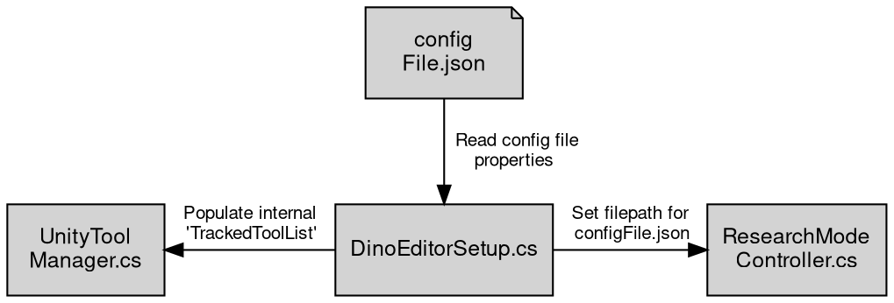
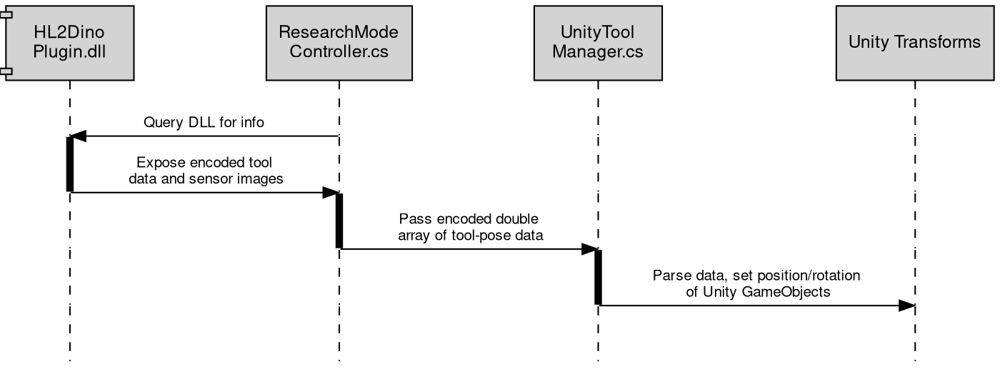

# Data Flow For DINO Unity

This project interacts with `DINO-DLL` by providing some input configuration info about tools, and it also receives encoded information about 'TrackedTool' pose ([check here to see what 'defines' a TrackedTool](TrackedTools.md))

There are some important files for setting up and running your Unity project properly:

1. `DinoConfig.json`: A config file which contains information about your tool geometries and IDs. 
> **Note:**  For now, this is assumed to be stored in your `StreamingAssets` folder, as this will be directly copied over to your HL2, which stays synchronised with the state of your Unity project.

2. `DinoEditorSetup.cs`: An Editor script, which will setup your Unity scene to add a Unity GameObject & Transform for each TrackedTool declared in `DinoConfig.json`. It tells `ResearchModeController.cs` the name of the config file to use from the `StreamingAssets` folder, and it also sets up `UnityToolManager.cs`, which maintains a list of TrackedTools

3. `ResearchModeController.cs`: A script which communicates with the C++ [DINO DLL](https://github.com/HL2-DINO/DINO-DLL) running on the HoloLens 2.

4. `UnityToolManager.cs`: A file which will iterate over its own internal 'list' of TrackedTool objects and position Unity transforms based on information received from `ResearchModeController.cs`

## Config File Logic

 
 

## Tool Pose Logic
 

